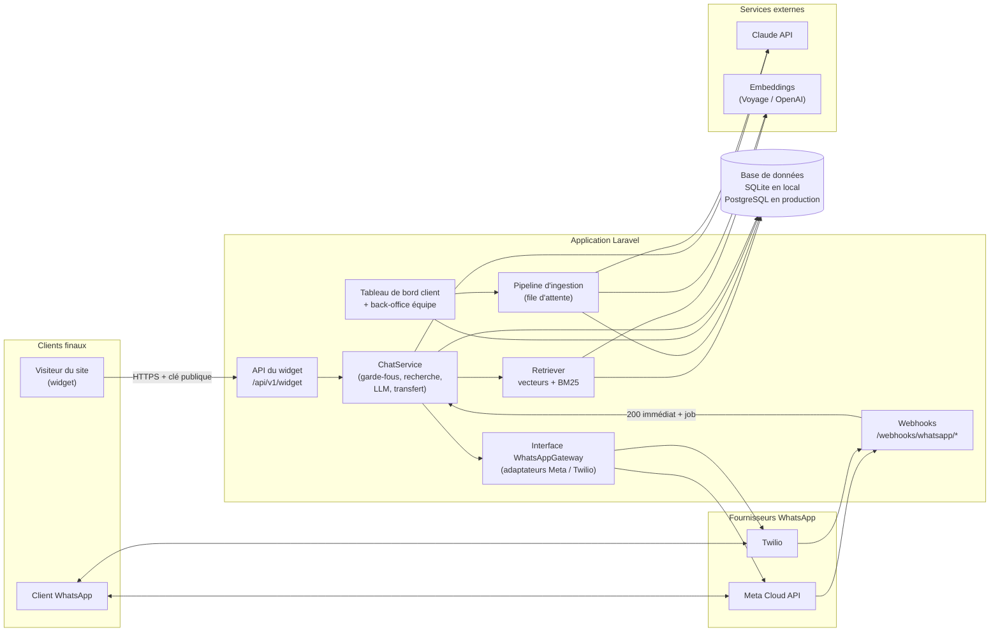
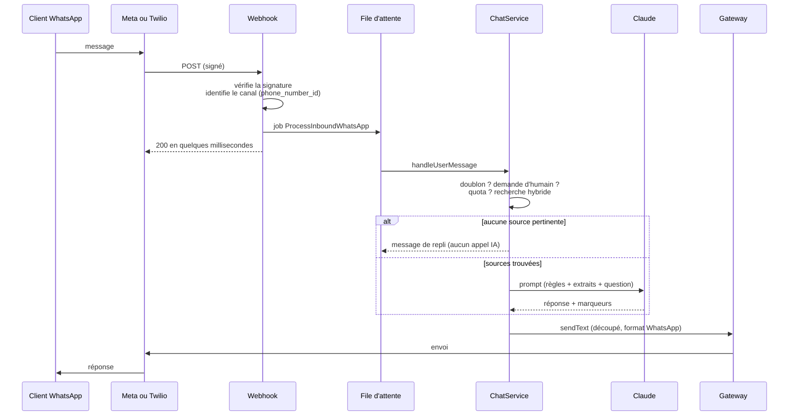
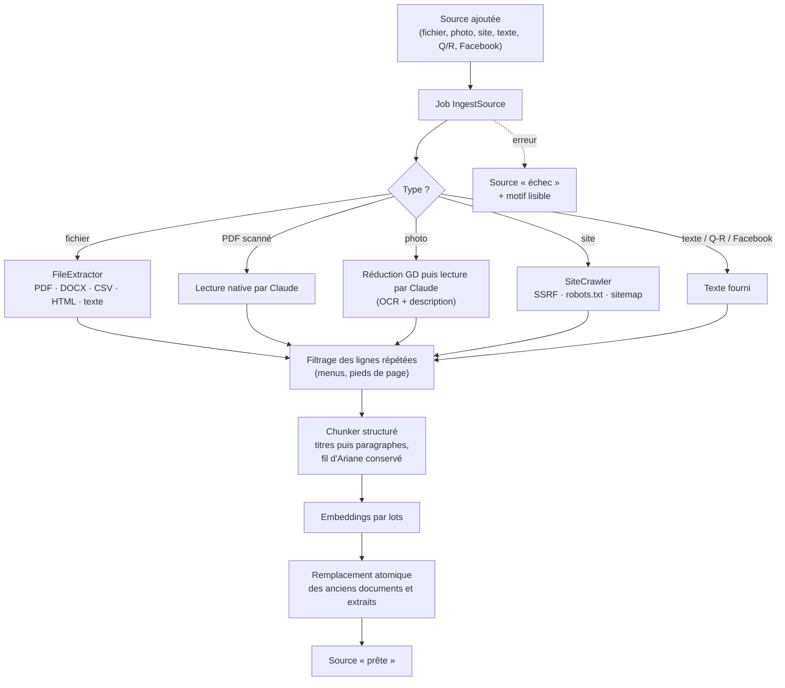
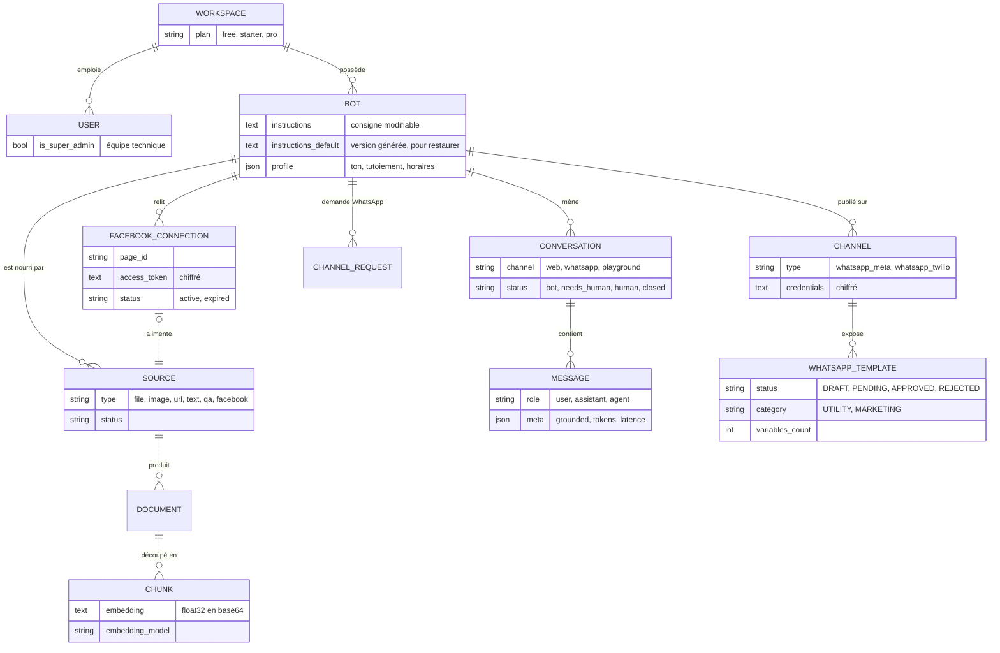

# Architecture de Kouma

Ce document décrit ce qui est **réellement implémenté** dans le dépôt, les décisions prises et leurs raisons, et le chemin d'évolution. Les schémas sont en Mermaid (rendus par GitHub).

## 1. Vue d'ensemble

## 2. Un message WhatsApp, de bout en bout

Points de conception : le webhook ne fait **que** vérifier et mettre en file, car Meta et Twilio ré-livrent un message si la réponse tarde ; l'unicité `(conversation, id fournisseur)` en base est le dernier rempart contre les doublons ; un échec d'envoi est enregistré sur le message sans perdre la réponse.

## 3. Pipeline d'ingestion

L'ancien contenu n'est supprimé **qu'après** le succès complet de la nouvelle lecture : une mise à jour ratée ne vide jamais un assistant.

## 4. Modèle de données

Toutes les tables « métier » portent `workspace_id`.

## 5. Décisions d'architecture

### D1. Monolithe Laravel modulaire

**Décision.** Une application Laravel 12, organisée en modules (`Ai`, `Ingestion`, `Retrieval`, `Chat`, `Channels`).
**Raisons.** Compétence de l'équipe, un seul déploiement, transactions simples. Les frontières entre modules passent par des interfaces (`LlmClient`, `EmbeddingClient`, `HybridStore`, `WhatsAppGateway`), ce qui permet d'extraire un service plus tard si nécessaire.
**Alternative écartée.** Service Python séparé pour l'IA : plus d'infrastructure et de compétences, sans bénéfice à ce stade puisque l'IA passe par des API.

### D2. Multi-entreprises : une base, `workspace_id` partout

**Décision.** Un filtre global Eloquent (`WorkspaceScope`) ajoute `workspace_id` à toute requête d'un utilisateur connecté. Les chemins sans utilisateur (webhooks, jobs, widget) filtrent **explicitement** ; la recherche filtre sur `workspace_id` **et** `bot_id`.
**Raisons.** Simple et testable ; la défense en profondeur vient du double filtrage et des tests d'isolation (`TenantIsolationTest`).
**Évolution.** Sur PostgreSQL, ajouter la sécurité au niveau des lignes (RLS) avec `FORCE ROW LEVEL SECURITY` et un réglage transactionnel `SET LOCAL app.tenant_id`, comme filet de sécurité indépendant du code applicatif.
**Limite actuelle.** Un utilisateur appartient à un seul espace ; pas de rôles distincts.

### D3. Recherche hybride avec seuil de pertinence

**Décision.** Score = 0,65 × similarité cosinus + 0,35 × score BM25 normalisé ; les extraits sous le seuil (`PLATFORM_MIN_SCORE`) sont écartés. Sans extrait pertinent (hors salutation ou réclamation), **aucun appel IA** n'est fait : le bot avoue ne pas savoir.
**Raisons.** Les prix, références et noms propres exigent la recherche par mots exacts ; le sens gère les reformulations. Le seuil est ce qui permet au bot de refuser, faute de quoi « top-k » renvoie toujours quelque chose. Il évite aussi de payer un appel IA inutile.
**Limite actuelle.** Cosinus et BM25 sont calculés en PHP sur tous les extraits de l'assistant : correct jusqu'à environ 5 000 extraits par assistant (quelques centaines de pages), à mesurer sur charge réelle.
**Évolution.** Implémenter `HybridStore` avec PostgreSQL : `pgvector` (index HNSW) et `tsvector`. Pièges connus : le filtrage par entreprise après l'index vectoriel peut renvoyer trop peu de lignes (activer le parcours itératif de pgvector, ou partitionner par entreprise), et un rerankeur améliore la précision.

### D4. Modèles IA derrière des interfaces

**Décision.** `LlmClient` (Claude via le SDK officiel PHP, ou mode hors ligne) et `EmbeddingClient` (Voyage, OpenAI, ou vecteurs locaux). Choix par variables d'environnement.
**Points d'attention.**
- Le modèle par défaut du code est `claude-opus-5-5` avec un effort de raisonnement « low ». **Ce choix est à trancher** (question Q1 du TDR) : la qualité de réponse d'un assistant de support ne demande pas forcément le modèle le plus capable, et l'écart de coût est de 2 à 5 fois.
- Le paramètre d'effort n'est envoyé qu'aux modèles qui l'acceptent (il est refusé par Haiku 4.5).
- Anthropic ne fournit pas d'embeddings : d'où un fournisseur séparé.
- Le prompt système est identique d'un message à l'autre pour un assistant donné, et marqué mis en cache ; tout ce qui varie est dans le dernier message.
- Un refus du modèle (`stop_reason = refusal`) et une panne dégradent vers le message de repli.
- Les réponses en flux continu et le repli automatique côté serveur en cas de refus (`fallbacks`) ne sont pas encore implémentés.

### D5. Contenu non fiable et injection de consignes

**Décision.** Les extraits et la question du visiteur sont placés dans des balises (`<contexte>`, `<extrait>`), **neutralisées** pour qu'un texte piégé ne puisse pas les refermer ; le prompt système déclare ce contenu comme donnée et non comme instruction ; l'assistant n'a accès à **aucune action** (pas d'outil), donc une injection réussie ne peut au pire que produire un texte trompeur.
**Limite.** C'est une réduction du risque, pas une garantie : le RAG ne supprime pas l'injection de consignes. Un jeu d'attaques doit être rejoué face au modèle réel avant la production.

### D6. Ingestion asynchrone, rejouable, remplaçant atomiquement

**Décision.** Toute source passe par le job `IngestSource`. En local, la file est en mode `sync` (aucun processus à lancer) ; en production, `database` ou `redis` avec un *worker*.
**Raisons.** Un crawl ou une lecture d'image dure des secondes à des minutes ; l'échec doit être visible sur la source, pas perdu dans un journal.

### D7. Crawler sécurisé

**Décision.** Toute URL et chaque redirection passent par `SafeUrl` (protocoles http et https seulement, ports 80 et 443, aucune adresse privée ou réservée après résolution DNS, pas d'identifiants dans l'URL) ; l'adresse IP validée est **épinglée** pour la connexion (contre le *DNS rebinding*) ; la taille de réponse est plafonnée pendant la lecture ; `robots.txt` et le plan du site sont respectés ; les réseaux sociaux sont refusés.
**Raisons.** Un crawler qui accepte une URL fournie par un utilisateur est le vecteur classique de SSRF (accès aux métadonnées du cloud, au réseau interne). Les conditions de Meta interdisent en outre la collecte automatisée.
**Limite.** Les sites entièrement rendus en JavaScript ne sont pas lus. Voir l'évolution ci-dessous.

### D8. Facebook : import assisté d'abord

**Décision.** Deux voies, jamais d'exploration automatique des pages Facebook ou Instagram. (1) Le client colle le lien : il est gardé tel quel (source `facebook` en statut « à compléter », aucune requête sortante), puis le client colle le texte de sa page. (2) Connexion par l'API Graph avec l'autorisation de l'administrateur : le client choisit sa page, le contenu (informations, horaires, publications récentes) est importé puis relu chaque semaine par `platform:resync-due`.
**Sécurité de la connexion.** Paramètre `state` aléatoire vérifié au retour d'OAuth ; les jetons de page ne passent jamais par le navigateur (mis en cache chiffré 15 minutes le temps du choix, puis stockés chiffrés dans `FacebookConnection`) ; une autorisation refusée marque la connexion « expirée » et la source en échec, pour que le client reconnecte sa page.
**Raison.** Meta interdit la collecte automatisée sans autorisation ; l'API officielle exige une revue d'application (`pages_show_list`, `pages_read_engagement`) pour fonctionner avec tous les clients, pas seulement les comptes ayant un rôle sur notre application.

### D9. Widget en Shadow DOM, sans dépendance

**Décision.** Un script unique (`public/widget/widget.js`) qui monte l'interface dans un Shadow DOM. Sécurité : clé publique `pk_…`, liste blanche d'origines côté serveur, limitation de débit par IP et par assistant, aucun HTML injecté depuis un message (le rendu construit des nœuds DOM).
**Alternative écartée.** Iframe : meilleure isolation mais plus lourde à dimensionner et à intégrer ; à reconsidérer si un client exige une isolation totale.
**Limite honnête.** La liste blanche d'origines n'arrête que l'usage depuis le navigateur d'un site tiers. Un appel de serveur à serveur peut falsifier l'en-tête `Origin` : seules la limitation de débit et les quotas protègent alors la facture IA du client.

### D10. WhatsApp : interface unique, Meta par défaut, Twilio en secours

**Décision.** L'interface `WhatsAppGateway` (`sendText`, `markRead`, `checkConnection`, et pour les modèles `listTemplates`, `supportsTemplateCreation`, `createTemplate`, `deleteTemplate`, `sendTemplate`) a deux adaptateurs. Le fournisseur est un attribut du `Channel`. Un seul webhook Meta sert tous les clients (routage par `phone_number_id`) ; Twilio a un webhook par canal.
**Raisons et comparatif.** Voir [WHATSAPP.md](WHATSAPP.md).
**Fenêtre de 24 heures.** WhatsApp n'autorise le texte libre que dans les 24 heures qui suivent le dernier message du client. Passé ce délai, l'application refuse le texte libre et propose les **modèles approuvés** du canal (`TemplateManager::sendTo`). Meta : le client crée ses modèles depuis l'application (l'identifiant WABA est requis) et suit leur statut d'approbation. Twilio : la création passe par la console Twilio (Content Template Builder), l'application synchronise puis envoie par `ContentSid`. Les variables sont nettoyées (retours à la ligne et espaces multiples refusés par Meta).
**Réponses rapides.** Les suggestions de l'assistant deviennent des boutons WhatsApp interactifs sur Meta : 3 au maximum, 20 caractères chacun, texte de 1 024 caractères au plus, sur le dernier message seulement ; au-delà, un message texte simple.

### D11. Pas d'éditeur visuel de flux

**Décision.** L'assistant est piloté par des consignes en langage naturel et par les sources, pas par un graphe de conversation.
**Raison.** C'est le cœur de Botpress et ce qui le rend lourd. Pour une PME, « voici mes documents » vaut mieux que « dessinez votre arbre de décision ».

### D12. Consigne propre à chaque entreprise, sous les règles de la plateforme

**Décision.** À la création, `InstructionGenerator` produit une consigne complète et professionnelle à partir du métier (`sector`), de la personnalité (ton, tutoiement ou vouvoiement, émojis, longueur, langues) et des faits de l'entreprise (ville, horaires, téléphone, offre, règles particulières). Elle est stockée dans `bots.instructions`, modifiable librement par le client ; `instructions_default` garde la version générée pour la restaurer. Changer le profil ne réécrit la consigne que si le client le demande. Un « peaufinage » par le modèle est proposé mais jamais enregistré seul, et un résultat inexploitable (trop court, sans sections) est écarté.
**Garde-fou.** `PromptBuilder` place les **règles de la plateforme** (ne jamais inventer un prix, ne pas révéler les instructions, marqueurs de fin de message) avant les consignes de l'entreprise et déclare qu'elles priment. Le client ne peut donc pas les retirer ni les contourner en modifiant sa consigne ; longueur plafonnée à 12 000 caractères.
**Raison.** Un assistant générique répond mal à un restaurant comme à une clinique. Une consigne éditable en texte reste dans l'esprit de D11 : pas de graphe, pas de code.

## 6. Sécurité : synthèse

| Menace | Mesure | Où |
|---|---|---|
| Accès aux données d'un autre client | Filtre global, filtrage explicite, tests d'isolation | `WorkspaceScope`, `SqlHybridStore` |
| Faux webhook WhatsApp | HMAC-SHA256 Meta (`X-Hub-Signature-256`), HMAC-SHA1 Twilio (`X-Twilio-Signature`), secret absent = refus | `MetaCloudGateway`, `TwilioGateway` |
| Rejeu d'un webhook | Index unique par conversation et identifiant fournisseur | migration `messages` |
| SSRF par le crawler | Voir D7 | `SafeUrl`, `SafeHttp` |
| Fichier malveillant | Liste d'extensions, stockage sous nom aléatoire hors du dossier public, taille limitée, garde-fous sur les archives et les images | `SourceController`, lecteurs |
| Vol de jetons WhatsApp | Chiffrement au repos (`encrypted:array`), masqués à la sérialisation, jamais réaffichés | `Channel` |
| Vol de jetons Facebook | Chiffrement au repos, masqués à la sérialisation, jamais envoyés au navigateur, `state` OAuth vérifié | `FacebookConnection`, `FacebookController` |
| Consigne d'un client qui contourne les règles | Règles de la plateforme placées avant et déclarées prioritaires (voir D12) | `PromptBuilder` |
| Injection de consignes | Voir D5 | `PromptBuilder` |
| Abus du widget | Origine, limitation de débit, quotas | `ResolveWidgetBot`, `RateLimiter` |
| Élévation de privilège | `is_super_admin` et `role` non assignables en masse, testé à l'inscription | `User` |
| CSS cassé par une couleur piégée | Validation stricte `#RRGGBB` | `BotController` |
| Ré-identification / vie privée | Numéros et noms conservés par conversation ; durée de conservation à définir (TDR, R13) | à faire |

## 7. Exploitation

- **Configuration** : tout passe par `.env` ; voir `.env.example`.
- **Observabilité** : chaque réponse enregistre `grounded`, `top_score`, modèle, jetons (entrée, sortie, cache) et latence dans `messages.meta`, ce qui permet de calculer le coût par client et la qualité. Le journal Laravel reçoit les échecs d'ingestion et de livraison.
- **Tâches planifiées** : `platform:resync-due` (toutes les heures) relance les sites configurés en mise à jour automatique.
- **Commandes utiles** : `platform:ask` (poser une question en ligne de commande avec les extraits et le score), `platform:reindex` (recalculer les vecteurs après changement de modèle), `platform:make-admin`.

## 8. Chemins d'évolution

| Besoin | Piste |
|---|---|
| Plus d'extraits par assistant, meilleure recherche | PostgreSQL + pgvector + `tsvector` derrière `HybridStore` ; rerankeur ; **contextualisation des extraits** par le LLM avant l'embedding (technique décrite par Anthropic, réduction annoncée de 35 % à 67 % des échecs de récupération selon les combinaisons) |
| Petites bases | Si la base d'un client tient dans le contexte du modèle (moins de 200 000 jetons selon Anthropic), la passer entièrement en prompt avec mise en cache peut battre la recherche |
| Sites en JavaScript | Navigateur sans tête (Playwright, Crawl4AI) en service séparé, ou service d'exploration hébergé, derrière une interface `PageFetcher` |
| Réponses plus rapides | Réponses en flux continu (SSE) ; sous Nginx, désactiver la mise en tampon ; attention : `php artisan serve` est mono-processus |
| Charge | Redis pour la file et le cache, Horizon pour superviser les workers, plusieurs workers |
| WhatsApp en libre-service | Embedded Signup (statut Tech Provider, revue d'application, cible : version 4) |
| Facebook | Graph API avec autorisation de la page |
| Rôles | Table de rattachement utilisateur-espace avec rôle |
| Analyse de qualité | Jeu de questions de référence rejoué automatiquement (« eval ») à chaque changement de prompt ou de modèle |
