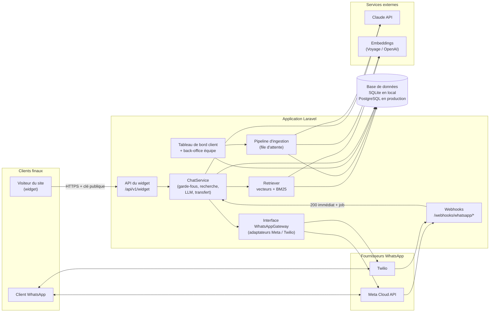
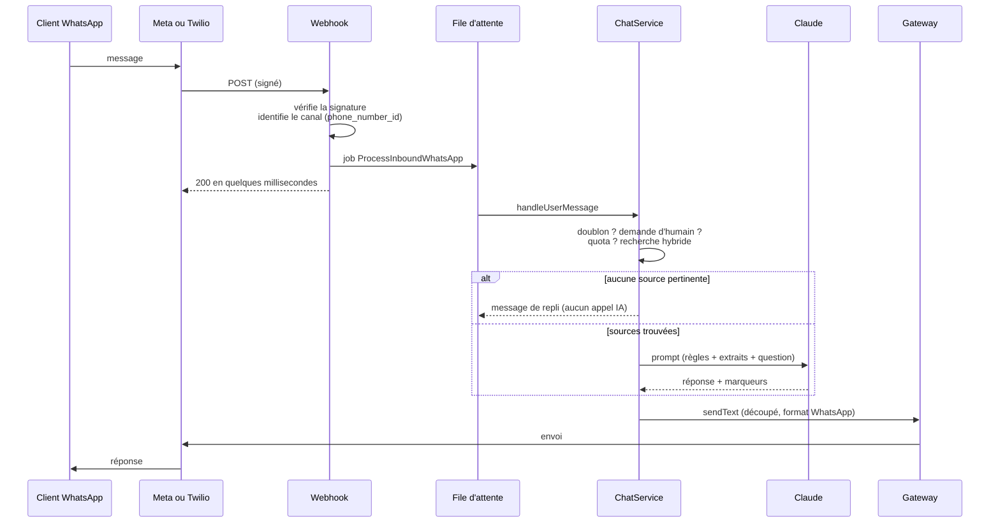
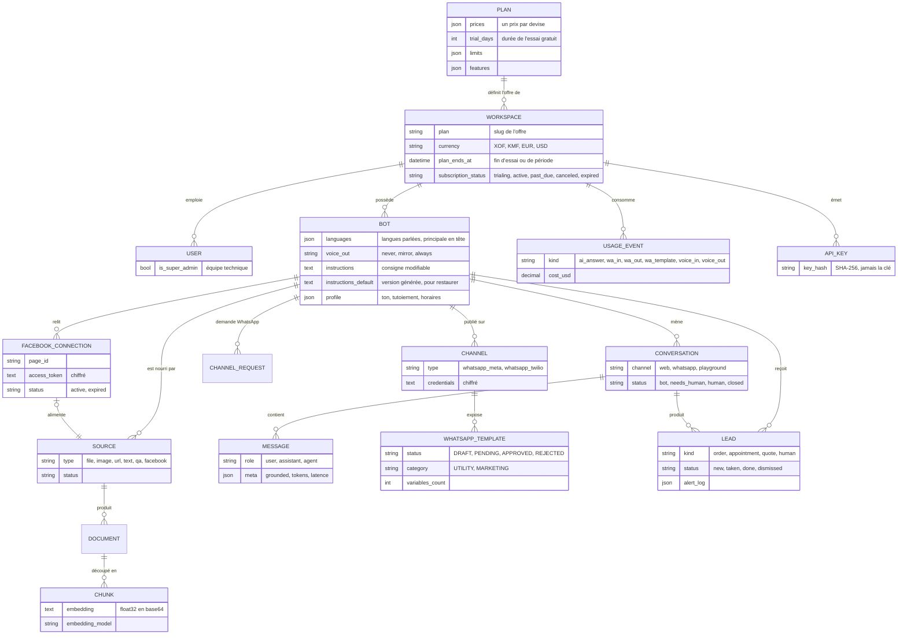

# Architecture de Kouma

Ce document décrit ce qui est **réellement implémenté** dans le dépôt, les décisions prises et leurs raisons, et le chemin d'évolution. Les schémas sont en Mermaid (rendus par GitHub).

## 1. Vue d'ensemble

## 2. Un message WhatsApp, de bout en bout

Points de conception : le webhook ne fait **que** vérifier et mettre en file, car Meta et Twilio ré-livrent un message si la réponse tarde ; l'unicité `(conversation, id fournisseur)` en base est le dernier rempart contre les doublons ; un échec d'envoi est enregistré sur le message sans perdre la réponse.

## 3. Pipeline d'ingestion

L'ancien contenu n'est supprimé **qu'après** le succès complet de la nouvelle lecture : une mise à jour ratée ne vide jamais un assistant.

## 4. Modèle de données

Toutes les tables « métier » portent `workspace_id`.

## 5. Décisions d'architecture

### D1. Monolithe Laravel modulaire

**Décision.** Une application Laravel 12, organisée en modules (`Ai`, `Ingestion`, `Retrieval`, `Chat`, `Channels`).
**Raisons.** Compétence de l'équipe, un seul déploiement, transactions simples. Les frontières entre modules passent par des interfaces (`LlmClient`, `EmbeddingClient`, `HybridStore`, `WhatsAppGateway`), ce qui permet d'extraire un service plus tard si nécessaire.
**Alternative écartée.** Service Python séparé pour l'IA : plus d'infrastructure et de compétences, sans bénéfice à ce stade puisque l'IA passe par des API.

### D2. Multi-entreprises : une base, `workspace_id` partout

**Décision.** Un filtre global Eloquent (`WorkspaceScope`) ajoute `workspace_id` à toute requête d'un utilisateur connecté. Les chemins sans utilisateur (webhooks, jobs, widget) filtrent **explicitement** ; la recherche filtre sur `workspace_id` **et** `bot_id`.
**Raisons.** Simple et testable ; la défense en profondeur vient du double filtrage et des tests d'isolation (`TenantIsolationTest`).
**Évolution.** Sur PostgreSQL, ajouter la sécurité au niveau des lignes (RLS) avec `FORCE ROW LEVEL SECURITY` et un réglage transactionnel `SET LOCAL app.tenant_id`, comme filet de sécurité indépendant du code applicatif.
**Limite actuelle.** Un utilisateur appartient à un seul espace ; pas de rôles distincts.

### D3. Recherche hybride avec seuil de pertinence

**Décision.** Score = 0,65 × similarité cosinus + 0,35 × score BM25 normalisé ; les extraits sous le seuil (`PLATFORM_MIN_SCORE`) sont écartés. Sans extrait pertinent (hors salutation ou réclamation), **aucun appel IA** n'est fait : le bot avoue ne pas savoir.
**Raisons.** Les prix, références et noms propres exigent la recherche par mots exacts ; le sens gère les reformulations. Le seuil est ce qui permet au bot de refuser, faute de quoi « top-k » renvoie toujours quelque chose. Il évite aussi de payer un appel IA inutile.
**Limite actuelle.** Cosinus et BM25 sont calculés en PHP sur tous les extraits de l'assistant : correct jusqu'à environ 5 000 extraits par assistant (quelques centaines de pages), à mesurer sur charge réelle.
**Évolution.** Implémenter `HybridStore` avec PostgreSQL : `pgvector` (index HNSW) et `tsvector`. Pièges connus : le filtrage par entreprise après l'index vectoriel peut renvoyer trop peu de lignes (activer le parcours itératif de pgvector, ou partitionner par entreprise), et un rerankeur améliore la précision.

### D4. Modèles IA derrière des interfaces

**Décision.** `LlmClient` (Claude via le SDK officiel PHP, ou mode hors ligne) et `EmbeddingClient` (Voyage, OpenAI, ou vecteurs locaux). Choix par variables d'environnement.
**Points d'attention.**
- Le modèle par défaut du code est `claude-opus-5-5` avec un effort de raisonnement « low ». **Ce choix est à trancher** (question Q1 du TDR) : la qualité de réponse d'un assistant de support ne demande pas forcément le modèle le plus capable, et l'écart de coût est de 2 à 5 fois.
- Le paramètre d'effort n'est envoyé qu'aux modèles qui l'acceptent (il est refusé par Haiku 4.5).
- Anthropic ne fournit pas d'embeddings : d'où un fournisseur séparé.
- Le prompt système est identique d'un message à l'autre pour un assistant donné, et marqué mis en cache ; tout ce qui varie est dans le dernier message.
- Un refus du modèle (`stop_reason = refusal`) et une panne dégradent vers le message de repli.
- Les réponses en flux continu et le repli automatique côté serveur en cas de refus (`fallbacks`) ne sont pas encore implémentés.

### D5. Contenu non fiable et injection de consignes

**Décision.** Les extraits et la question du visiteur sont placés dans des balises (`<contexte>`, `<extrait>`), **neutralisées** pour qu'un texte piégé ne puisse pas les refermer ; le prompt système déclare ce contenu comme donnée et non comme instruction ; l'assistant n'a accès à **aucune action** (pas d'outil), donc une injection réussie ne peut au pire que produire un texte trompeur.
**Limite.** C'est une réduction du risque, pas une garantie : le RAG ne supprime pas l'injection de consignes. Un jeu d'attaques doit être rejoué face au modèle réel avant la production.

### D6. Ingestion asynchrone, rejouable, remplaçant atomiquement

**Décision.** Toute source passe par le job `IngestSource`. En local, la file est en mode `sync` (aucun processus à lancer) ; en production, `database` ou `redis` avec un *worker*.
**Raisons.** Un crawl ou une lecture d'image dure des secondes à des minutes ; l'échec doit être visible sur la source, pas perdu dans un journal.

### D7. Crawler sécurisé

**Décision.** Toute URL et chaque redirection passent par `SafeUrl` (protocoles http et https seulement, ports 80 et 443, aucune adresse privée ou réservée après résolution DNS, pas d'identifiants dans l'URL) ; l'adresse IP validée est **épinglée** pour la connexion (contre le *DNS rebinding*) ; la taille de réponse est plafonnée pendant la lecture ; `robots.txt` et le plan du site sont respectés ; les réseaux sociaux sont refusés.
**Raisons.** Un crawler qui accepte une URL fournie par un utilisateur est le vecteur classique de SSRF (accès aux métadonnées du cloud, au réseau interne). Les conditions de Meta interdisent en outre la collecte automatisée.
**Limite.** Les sites entièrement rendus en JavaScript ne sont pas lus. Voir l'évolution ci-dessous.

### D8. Facebook : import assisté d'abord

**Décision.** Deux voies, jamais d'exploration automatique des pages Facebook ou Instagram. (1) Le client colle le lien : il est gardé tel quel (source `facebook` en statut « à compléter », aucune requête sortante), puis le client colle le texte de sa page. (2) Connexion par l'API Graph avec l'autorisation de l'administrateur : le client choisit sa page, le contenu (informations, horaires, publications récentes) est importé puis relu chaque semaine par `platform:resync-due`.
**Sécurité de la connexion.** Paramètre `state` aléatoire vérifié au retour d'OAuth ; les jetons de page ne passent jamais par le navigateur (mis en cache chiffré 15 minutes le temps du choix, puis stockés chiffrés dans `FacebookConnection`) ; une autorisation refusée marque la connexion « expirée » et la source en échec, pour que le client reconnecte sa page.
**Raison.** Meta interdit la collecte automatisée sans autorisation ; l'API officielle exige une revue d'application (`pages_show_list`, `pages_read_engagement`) pour fonctionner avec tous les clients, pas seulement les comptes ayant un rôle sur notre application.

### D9. Widget en Shadow DOM, sans dépendance

**Décision.** Un script unique (`public/widget/widget.js`) qui monte l'interface dans un Shadow DOM. Sécurité : clé publique `pk_…`, liste blanche d'origines côté serveur, limitation de débit par IP et par assistant, aucun HTML injecté depuis un message (le rendu construit des nœuds DOM).
**Alternative écartée.** Iframe : meilleure isolation mais plus lourde à dimensionner et à intégrer ; à reconsidérer si un client exige une isolation totale.
**Limite honnête.** La liste blanche d'origines n'arrête que l'usage depuis le navigateur d'un site tiers. Un appel de serveur à serveur peut falsifier l'en-tête `Origin` : seules la limitation de débit et les quotas protègent alors la facture IA du client.

### D10. WhatsApp : interface unique, Meta par défaut, Twilio en secours

**Décision.** L'interface `WhatsAppGateway` (`sendText`, `sendAudio`, `downloadMedia`, `markRead`, `checkConnection`, et pour les modèles `listTemplates`, `supportsTemplateCreation`, `createTemplate`, `deleteTemplate`, `sendTemplate`) a deux adaptateurs. **Les messages sont payés par la plateforme, pas par le client** : un canal sans identifiants propres utilise les comptes de la plateforme (réglages `whatsapp.*`), et la consommation est mesurée par client (D14). Le fournisseur est un attribut du `Channel`. Un seul webhook Meta sert tous les clients (routage par `phone_number_id`) ; Twilio a un webhook par canal.
**Raisons et comparatif.** Voir [WHATSAPP.md](WHATSAPP.md).
**Fenêtre de 24 heures.** WhatsApp n'autorise le texte libre que dans les 24 heures qui suivent le dernier message du client. Passé ce délai, l'application refuse le texte libre et propose les **modèles approuvés** du canal (`TemplateManager::sendTo`). Meta : le client crée ses modèles depuis l'application (l'identifiant WABA est requis) et suit leur statut d'approbation. Twilio : la création passe par la console Twilio (Content Template Builder), l'application synchronise puis envoie par `ContentSid`. Les variables sont nettoyées (retours à la ligne et espaces multiples refusés par Meta).
**Réponses rapides.** Les suggestions de l'assistant deviennent des boutons WhatsApp interactifs sur Meta : 3 au maximum, 20 caractères chacun, texte de 1 024 caractères au plus, sur le dernier message seulement ; au-delà, un message texte simple.

### D11. Pas d'éditeur visuel de flux

**Décision.** L'assistant est piloté par des consignes en langage naturel et par les sources, pas par un graphe de conversation.
**Raison.** C'est le cœur de Botpress et ce qui le rend lourd. Pour une PME, « voici mes documents » vaut mieux que « dessinez votre arbre de décision ».

### D12. Consigne propre à chaque entreprise, sous les règles de la plateforme

**Décision.** À la création, `InstructionGenerator` produit une consigne complète et professionnelle à partir du métier (`sector`), de la personnalité (ton, tutoiement ou vouvoiement, émojis, longueur, langues) et des faits de l'entreprise (ville, horaires, téléphone, offre, règles particulières). Elle est stockée dans `bots.instructions`, modifiable librement par le client ; `instructions_default` garde la version générée pour la restaurer. Changer le profil ne réécrit la consigne que si le client le demande. Un « peaufinage » par le modèle est proposé mais jamais enregistré seul, et un résultat inexploitable (trop court, sans sections) est écarté.
**Garde-fou.** `PromptBuilder` place les **règles de la plateforme** (ne jamais inventer un prix, ne pas révéler les instructions, marqueurs de fin de message) avant les consignes de l'entreprise et déclare qu'elles priment. Le client ne peut donc pas les retirer ni les contourner en modifiant sa consigne ; longueur plafonnée à 12 000 caractères.
**Raison.** Un assistant générique répond mal à un restaurant comme à une clinique. Une consigne éditable en texte reste dans l'esprit de D11 : pas de graphe, pas de code.

### D13. Offres : un prix par devise, un essai gratuit qui expire

**Décision.** Chaque offre (`plans`) porte un prix **par devise** (`prices` : FCFA, franc comorien, euro, dollar), ses quotas, ses options et, pour l'offre gratuite, une durée d'essai (`trial_days`, 14 jours). Tout se règle depuis l'administration, sans code. Le FCFA est la devise de référence (obligatoire) ; une devise laissée vide n'est pas proposée et le client voit alors le prix en FCFA, jamais un prix converti. Le visiteur choisit sa devise par `?devise=EUR` (mémorisée en session par `SetCurrency`) ; le client garde la sienne sur son espace (`workspaces.currency`), et chaque paiement enregistré porte sa propre devise. Les recettes s'additionnent par devise, jamais entre devises.
**Essai gratuit.** À l'inscription, l'espace reçoit une date de fin (`plan_ends_at`). Passé ce délai, `Workspace::trialExpired()` est vrai : `UsageService::canReply` refuse, l'assistant répond « momentanément indisponible » sans appel IA (raison `trial_expired`), et un bandeau invite à choisir une offre. Les données et l'accès au tableau de bord sont conservés. La commande quotidienne `platform:subscriptions` envoie le rappel avant la fin et le message de fin, une seule fois chacun. Un abonné dont la période de grâce est écoulée repasse à l'offre gratuite avec un essai déjà consommé.
**Raisons.** Les prix sont calculés d'après les coûts réels (voir [COUTS.md](COUTS.md), section 6). L'offre à 10 000 FCFA n'inclut pas WhatsApp, dont l'intégration coûte trop cher pour ce prix.
**Limite.** L'essai est par espace, pas par personne : rien n'empêche de s'inscrire à nouveau avec une autre adresse. Un contrôle par numéro de téléphone ou par entreprise reste à décider.

### D14. Mesure de la consommation : un journal d'événements avec un coût estimé

**Décision.** Tout ce qui coûte de l'argent écrit une ligne dans `usage_events` (`UsageMeter`) : réponse IA (jetons, fournisseur), message WhatsApp entrant, sortant ou en modèle (catégorie Meta), message vocal écouté ou dit. Le coût vient de `CostCalculator` (tarifs réglables dans l'administration : frais Twilio, catégories Meta, minutes de voix, parités monétaires). La page **Consommation** du super admin lit ce journal en temps réel (par client, par période, marge estimée) et lit le solde du portefeuille Twilio (`TwilioWallet`) ; `platform:check-wallets` alerte par e-mail quand le solde passe sous un seuil ou qu'un client approche son volume.
**Volume et recharge.** Chaque offre inclut un volume de messages WhatsApp et de messages vocaux par mois. `UsageService` refuse l'envoi au-delà (WhatsApp : après consommation du crédit `wa_credit`, acheté par Mobile Money et ajouté par l'équipe).
**Limite.** Les coûts sont des **estimations** : la facture réelle de Meta ou de Twilio fait foi. Le journal ne bloque jamais une réponse : une erreur de comptage est journalisée et ignorée.

### D15. Offre pour développeurs : clés d'API par assistant

**Décision.** Une offre `api` (`audience = developer`) donne accès à `POST /api/v1/chat` avec une clé secrète `kma_...` liée à un assistant. Seul le **hachage SHA-256** de la clé est stocké ; elle n'est montrée qu'une fois. Le point d'accès réutilise `ChatService` (mêmes garde-fous, mêmes quotas), identifie la conversation par un `conversation_id` fourni par le développeur, et répond avec l'usage du mois. Limitation de débit par clé, erreurs à code stable (`missing_key`, `invalid_key`, `plan_required`, `account_suspended`, `quota_exceeded`). La page publique `/developpeurs` présente l'offre ; les offres de cette audience n'apparaissent jamais sur les pages tarifaires des entreprises.

### D16. Langues et voix

**Décision.** Un assistant parle une **liste** de langues (`bots.languages`, principale en tête), choisie et modifiable par le client ; chaque langue a un niveau de fiabilité annoncé (`config/languages.php`). La règle de langue du prompt est construite depuis cette liste (`Languages::promptRule`). La voix passe par l'interface `SpeechClient` (comme `LlmClient`) : `OpenAiSpeech` couvre OpenAI et tout serveur libre compatible, `SpeechRouter` envoie les langues locales vers un serveur libre quand il existe, `FakeSpeech` sert aux tests. `VoiceService` applique l'offre (option `voice`), le volume mensuel, les limites de durée, les réglages de l'assistant (écouter ; répondre jamais, en miroir ou toujours) et le comptage ; **la voix ne peut jamais faire perdre une réponse écrite**.
**Ce qui n'est pas fait.** Aucune synthèse vocale libre à licence commerciale n'existe pour le bambara, le dioula ou le mooré : ces langues restent écrites. Détail, licences et branchement d'un serveur libre : [LANGUES.md](LANGUES.md).

### D17. Demandes à traiter et alertes du propriétaire

**Décision.** Quand un client confirme une commande, une réservation ou un devis (marqueur `[[LEAD: commande | résumé]]` placé par l'assistant, retiré avant l'affichage) ou demande une personne, `LeadService` crée une **demande** (`leads`) : une seule demande ouverte par conversation et par type. `LeadNotifier` prévient le propriétaire selon **ses** choix (page Alertes, `workspaces.settings.alerts`) : tableau de bord toujours, e-mail (adresse au choix), WhatsApp vers son numéro. Hors des 24 h de la fenêtre de service, WhatsApp n'accepte qu'un **modèle approuvé** : l'application propose de créer le modèle d'alerte ; sans lui, l'alerte n'est pas envoyée et le journal de la demande (`alert_log`) le dit. `leads:remind` (toutes les 10 minutes) relance trois fois au plus, à l'intervalle choisi ; répondre au client ou prendre la demande en charge arrête les rappels.
**Étiquettes WhatsApp.** L'API WhatsApp Cloud ne permet pas d'étiqueter une conversation (les étiquettes n'existent que dans l'application WhatsApp Business, et restent manuelles même en coexistence). Les demandes jouent ce rôle dans Kouma (page Demandes, étiquettes dans la boîte de réception), et l'application indique pour chacune l'étiquette à poser à la main si le client utilise aussi l'application.

### D18. Import des discussions WhatsApp

**Décision.** Option `chat_import` (incluse dès Pro, achetable à la carte : `workspaces.settings.addons`, activée par l'équipe quand elle approuve la demande `addon:chat_import`). Le client dépose l'export d'une discussion (`.txt` ou `.zip`), coche son consentement, dit qui il est, puis **valide** le style et les paires question / réponse avant tout enregistrement. Le fichier n'est jamais conservé ; seule une version **pseudonymisée** (participants P1, P2..., numéros, e-mails, suites de chiffres et liens à paramètres masqués) reste 30 minutes dans le cache pendant la validation. Les paires validées deviennent **une** source texte (« Réponses habituelles »), remplacée à chaque nouvel import ; le style devient un bloc `<style_entreprise>` du prompt, traité comme une donnée (balises neutralisées) et placé sous les règles de la plateforme : il change la forme des réponses, jamais leur contenu.
**Raison.** Les vraies conversations donnent le ton et les réponses habituelles, mais contiennent des données de tiers : d'où l'anonymisation avant stockage, la validation humaine et l'absence de conservation du brut.

### D19. Widget et démonstration

**Widget.** Toujours en Shadow DOM, sans dépendance, écrit en ES5 (navigateurs Android anciens). Il propose : réponses qui s'écrivent, micro (vocal), écoute d'une réponse, copie, avis (pouces, stockés dans `messages.meta.feedback`), choix de la langue, nouvelle conversation (la précédente est close), lien « Continuer sur WhatsApp » quand l'offre et le canal le permettent, bulle d'accroche une fois par session.
**Démonstration de la page d'accueil.** Un appareil pliable interactif (`resources/js/playground`) : dialogue local déterministe (`nlu.js`, aucun appel réseau ni IA), alertes réglables côté commerçant, réponses et confirmations, écran de couverture. Il reste un **exemple fictif** ; une histoire se joue d'abord seule et s'arrête au premier geste du visiteur. Le moteur de dialogue est testé sous Node (`tests/Js/playground-nlu.mjs`).

### D20. Référencement : pages décrites par la configuration, chiffres tirés des offres

**Décision.** Les pages de contenu du site public (solutions, guides, métiers, pays) sont des **données** (`config/seo.php`) rendues par deux vues communes (`seo/page`, `seo/hub`), pas du code par page. `App\Support\SeoPages` résout les jetons `{price:offre}`, `{limit:offre:quota}` et `{trial_days}` depuis la table des offres : un changement de prix dans l'admin met à jour les guides. Les prix des pages de contenu sont stables (devise de la page, sinon celle de la plateforme) et ne suivent pas le choix de devise du visiteur, pour que les moteurs voient toujours les mêmes chiffres. Toutes les pages publiques passent par `<x-seo>` (titre, description, canonique, Open Graph, `summary_large_image`, données structurées). Le plan du site, `robots.txt` et `llms.txt` sont produits par `LandingController`. `SeoPagesTest` refuse les titres trop longs, les doublons, les liens internes cassés, les jetons oubliés et les dates futures. Procédure et limites : `docs/SEO.md`.

### D21. L'assistant de la page d'accueil se met à jour avec les offres

**Décision.** L'assistant qui répond aux visiteurs (la « vitrine ») n'a pas de texte écrit à la main : `App\Services\LandingBot` rédige ses sources à partir de la table des offres, de `config/languages.php` et des réglages de la marque, puis les fait lire par le pipeline d'ingestion habituel. Une source inchangée n'est pas relue ; une source qui disparaît des textes est supprimée ; la consigne suit les règles sauf si elle a été modifiée à la main. Chaque source répond à une question courte (« Combien ça coûte ? », « Comment payer ? ») : les recherches courtes des visiteurs tombent ainsi sur la bonne réponse. `platform:landing-bot` le crée ou le met à jour (indispensable en production, où il n'existe pas encore) ; l'administration le relance après chaque enregistrement d'offre, une fois la réponse envoyée.

### D22. Conversation libre pour tous les assistants, informations de l'entreprise tirées des seuls extraits

**Décision.** Un assistant n'est plus muet hors de sa base de connaissances : salutations, prise de nouvelles, questions simples et bavardage reçoivent une réponse du modèle (`Bot::allowsFreeChat()`, réglage « Autoriser la conversation libre » stocké dans `bots.profile.open_chat`, actif par défaut, sans migration). Le prompt de la plateforme sépare deux régimes : la conversation générale est libre ; tout ce qui concerne l'entreprise (prix, horaires, adresses, délais, politiques) ne vient que des extraits, avec le marqueur `[[NO_ANSWER]]` quand l'information manque. L'assistant de la page d'accueil de la plateforme (`Bot::isShowcase()`) converse toujours librement. Tous les assistants des clients savent aussi dire **qui les a conçus** : « propulsé par Kouma », avec le site, l'e-mail et le lien WhatsApp des réglages de la marque (`PromptBuilder::originRule()`), et se présentent comme une intelligence artificielle, jamais comme une personne.

**Contrepartie.** Sans extrait pertinent, le modèle est désormais appelé : plus de réponses, donc plus de volume consommé et de coût. Cocher la case la désactive et rétablit l'ancien comportement (réponse de repli sans appel au modèle). Le risque d'une réponse inventée sur l'entreprise est borné par le prompt, pas par un garde-fou déterministe : à surveiller sur le jeu de questions de référence. `meta.free_chat` marque ces réponses.

### D23. Les tableaux sont lus comme des catalogues

**Décision.** Un fichier Excel (`.xlsx`) ou CSV passe par `TableReader` : il repère l'en-tête, reconnaît les colonnes (français et anglais, export du Commerce Manager de Meta compris), normalise prix et disponibilités (`Money`), range les produits par catégorie et les écrit en texte (`CatalogFormatter`, une phrase par produit, une section par catégorie, un paragraphe d'ensemble). `XlsxReader` lit les classeurs sans dépendance (archive plafonnée, XML sans réseau). Le résumé (nombre de produits, constats) remonte par `ExtractedDocument::meta` jusqu'à `sources.stats` et s'affiche au client. Un tableau qui n'a pas de colonne « nom » avec « prix » ou « description » reste lu ligne par ligne comme avant.

**Garde-fous.** Les colonnes d'achat, de marge et de fournisseur ne sont jamais lues, et le client en est averti. Les lignes d'exemple du modèle téléchargeable (« (à supprimer) ») sont ignorées. Un produit sans prix reste connu mais n'est pas chiffré. Le même `CatalogFormatter` servira à l'import direct du catalogue Meta (`docs/CATALOGUE.md`, étape 2).

### D24. Les modèles WhatsApp viennent d'une bibliothèque et se créent tout seuls

**Décision.** Les modèles de messages ne se rédigent plus un par un : `config/whatsapp_templates.php` en décrit 28 (français, 12 en anglais), `TemplateLibrary` les prépare (nom de l'entreprise inscrit, boutons retirés si l'adresse ou le numéro manque) et `TemplateProvisioner` les crée par paquets sur un canal, de façon rejouable (un modèle qui existe n'est jamais recréé, un refus n'arrête pas les suivants, trois refus de suite arrêtent tout). `MetaCloudGateway` crée par l'API Graph ; `TwilioGateway` crée désormais par l'API Content (contenu puis demande d'approbation, nettoyage si elle échoue). À l'activation d'un canal (`ChannelRequestController`), le paquet de base et celui du métier de l'assistant partent à l'approbation après l'envoi de la réponse, si l'offre inclut les modèles.

**Garde-fous.** `WhatsAppTemplateLibraryTest` refuse tout modèle qui enfreint les règles de Meta (variables, exemples, longueurs, titre, promotion dans un modèle utilitaire, absence de mention STOP dans un modèle marketing). Les tests désactivent la création automatique (`phpunit.xml`) pour ne jamais appeler un fournisseur. Les envois automatiques déclenchés par un événement (commande confirmée) restent à faire.

### D25. La mesure d'audience est maison, sans adresse IP, et lit ses chiffres dans deux tables

**Décision.** Plutôt qu'un service tiers (données envoyées à l'étranger, cookies publicitaires, bannière de consentement), la plateforme compte elle-même : `resources/js/analytics.js` envoie des lots d'événements par `sendBeacon` à `POST /a/e` (`Tracker::collect`), et les actions de l'application sont enregistrées par le middleware `RecordActions` d'après une table de routes de `config/analytics.php`. Deux tables : `analytics_sessions` (une visite) et `analytics_events` (un geste), avec jour, heure et jour de la semaine déjà rangés pour que les cartes d'affluence tiennent en SQL portable (MySQL, SQLite). `Stats`, `ClientStats`, `Insights`, `ChatStats` lisent ; la page `/admin/statistiques` (super administrateur) affiche neuf onglets, l'export CSV et l'e-mail du lundi. Côté client, `CustomerRhythm` montre les heures d'affluence de ses propres clients sans rien emprunter à ces tables.

**Garde-fous.** Aucune adresse IP stockée ; aucun texte saisi lu ; e-mails et numéros effacés des libellés ; « Ne pas suivre », Global Privacy Control et le refus du visiteur coupent tout ; les modèles n'utilisent pas `BelongsToWorkspace` mais aucune page cliente ne les lit (`AnalyticsTest`) ; la mesure ne casse jamais une requête (erreurs journalisées) ; purge nocturne au-delà de la durée de conservation. Détails et limites : `docs/ANALYTICS.md`.

### D26. Notifications : un point d'entrée, Web Push sans bibliothèque, envoi par morceaux

**Décision.** `Notifier` est l'unique point d'entrée : il applique les choix de la personne (catégories, heures calmes, plafond d'un message promo par jour, doublons), écrit dans le centre de notifications (`app_notifications`, cloche et compteur sur l'icône) et envoie sur les appareils par `PushGateway` (`WebPushGateway`). Le chiffrement Web Push (RFC 8291) et la signature VAPID (RFC 8292) sont écrits en PHP avec OpenSSL (`app/Push/WebPushCrypto.php`, validé contre l'annexe A de la RFC) : aucune bibliothèque de plus, car sur un hébergement sans SSH chaque paquet est un envoi de milliers de fichiers. Les campagnes de l'équipe (`push_campaigns`) s'envoient par morceaux (`CampaignSender`, curseur `cursor_user_id`) depuis `notifications:dispatch`, pour tenir dans la durée d'une requête ou d'un passage de cron mutualisé. Les textes des événements sont dans `Events`, une seule fois, e-mail compris.

**Garde-fous.** Adresses d'abonnement filtrées (`PushEndpoint`), dix appareils par personne, appareil retiré après 404/410 ou cinq échecs, déconnexion qui détache l'appareil, clés VAPID chiffrées et jamais affichées, envoi après la réponse dans une requête web (le visiteur n'attend pas Google), tests sans réseau (`FakePushGateway`). Détails : `docs/NOTIFICATIONS.md`.

### D27. Un seul gabarit d'e-mail, avec aperçu

**Décision.** Les anciens `Mail::raw` (texte brut) sont remplacés par `App\Mail\Notice` et le gabarit `components/mail/*` (bandeau de la marque, filet safran, bouton, faits, signature, version texte). Les e-mails d'événements sont construits par `Events` ; `MailCatalog` les capture avec des données d'exemple pour l'aperçu (Administration, E-mails) et pour le test de rendu de chacun.

### D28. La supervision lit toutes les conversations, hors du périmètre d'entreprise, et laisse une trace

**Décision.** Le super administrateur voit toutes les conversations (visiteurs de l'assistant de Kouma et clients de chaque entreprise) depuis `/admin/conversations`. `ChatQuery` les lit avec `withoutGlobalScopes()` et des sous-requêtes (aucune requête par ligne) ; `ChatDiagnosis` en tire, sans IA, l'issue, une note sur 100 et des signaux en clair ; le résumé par IA n'existe qu'à la demande (`ChatSummarizer`). Les notes, signalements et marques « examinée » vivent dans `conversation_notes`, séparée des conversations pour qu'aucune vue cliente ne puisse les afficher par accident.

**Garde-fous.** Route réservée au super administrateur ; chaque ouverture, note, signalement, résumé et export est inscrit au journal (l'ouverture une fois par heure et par conversation) ; numéros masqués hors visiteurs de Kouma ; export CSV sans e-mail et à cellules neutralisées ; résumé jamais imputé au client ; mention dans la page Confidentialité. Détails et limites : `docs/SUPERVISION.md`.

## 6. Sécurité : synthèse

| Menace | Mesure | Où |
|---|---|---|
| Accès aux données d'un autre client | Filtre global, filtrage explicite, tests d'isolation | `WorkspaceScope`, `SqlHybridStore` |
| Faux webhook WhatsApp | HMAC-SHA256 Meta (`X-Hub-Signature-256`), HMAC-SHA1 Twilio (`X-Twilio-Signature`), secret absent = refus | `MetaCloudGateway`, `TwilioGateway` |
| Rejeu d'un webhook | Index unique par conversation et identifiant fournisseur | migration `messages` |
| SSRF par le crawler | Voir D7 | `SafeUrl`, `SafeHttp` |
| Fichier malveillant | Liste d'extensions, stockage sous nom aléatoire hors du dossier public, taille limitée, garde-fous sur les archives et les images | `SourceController`, lecteurs |
| Vol de jetons WhatsApp | Chiffrement au repos (`encrypted:array`), masqués à la sérialisation, jamais réaffichés | `Channel` |
| Vol de jetons Facebook | Chiffrement au repos, masqués à la sérialisation, jamais envoyés au navigateur, `state` OAuth vérifié | `FacebookConnection`, `FacebookController` |
| Consigne d'un client qui contourne les règles | Règles de la plateforme placées avant et déclarées prioritaires (voir D12) | `PromptBuilder` |
| Injection de consignes | Voir D5 | `PromptBuilder` |
| Abus du widget | Origine, limitation de débit, quotas | `ResolveWidgetBot`, `RateLimiter` |
| Élévation de privilège | `is_super_admin` et `role` non assignables en masse, testé à l'inscription | `User` |
| CSS cassé par une couleur piégée | Validation stricte `#RRGGBB` | `BotController` |
| Ré-identification / vie privée | Numéros et noms conservés par conversation ; durée de conservation à définir (TDR, R13) | à faire |

## 7. Exploitation

- **Configuration** : tout passe par `.env` ; voir `.env.example`.
- **Observabilité** : chaque réponse enregistre `grounded`, `top_score`, modèle, jetons (entrée, sortie, cache) et latence dans `messages.meta`, ce qui permet de calculer le coût par client et la qualité. Le journal Laravel reçoit les échecs d'ingestion et de livraison.
- **Tâches planifiées** : `platform:resync-due` (toutes les heures) relance les sites configurés en mise à jour automatique.
- **Commandes utiles** : `platform:ask` (poser une question en ligne de commande avec les extraits et le score), `platform:reindex` (recalculer les vecteurs après changement de modèle), `platform:make-admin`.

## 8. Chemins d'évolution

| Besoin | Piste |
|---|---|
| Plus d'extraits par assistant, meilleure recherche | PostgreSQL + pgvector + `tsvector` derrière `HybridStore` ; rerankeur ; **contextualisation des extraits** par le LLM avant l'embedding (technique décrite par Anthropic, réduction annoncée de 35 % à 67 % des échecs de récupération selon les combinaisons) |
| Petites bases | Si la base d'un client tient dans le contexte du modèle (moins de 200 000 jetons selon Anthropic), la passer entièrement en prompt avec mise en cache peut battre la recherche |
| Sites en JavaScript | Navigateur sans tête (Playwright, Crawl4AI) en service séparé, ou service d'exploration hébergé, derrière une interface `PageFetcher` |
| Réponses plus rapides | Réponses en flux continu (SSE) ; sous Nginx, désactiver la mise en tampon ; attention : `php artisan serve` est mono-processus |
| Charge | Redis pour la file et le cache, Horizon pour superviser les workers, plusieurs workers |
| WhatsApp en libre-service | Embedded Signup (statut Tech Provider, revue d'application, cible : version 4) |
| Facebook | Graph API avec autorisation de la page |
| Rôles | Table de rattachement utilisateur-espace avec rôle |
| Analyse de qualité | Jeu de questions de référence rejoué automatiquement (« eval ») à chaque changement de prompt ou de modèle |
